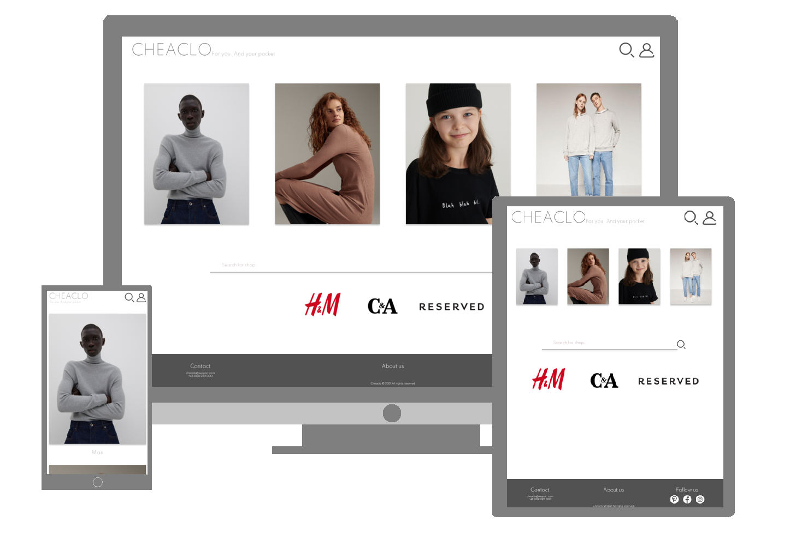

# Client Front Microservice

Project is a microservice, which is part of [Cheaclo](https://github.com/cheaclo/about) project. The application is a implementation of client side, based on [Angular](https://angular.io) framework.

## Tech stack

`typescript 4.3.5`

`angular 12.2.7` 

## Details

    

Cheaclo is an aggregator of clothes discounts. User can find here desired product of [CA](https://www.c-and-a.com/eu/en), [HM](https://www2.hm.com/en_gb), [Reserved](https://www.reserved.com/gb/en). Website provides various functionalities like:

- Sign in and sign up
- Search products by title
- Filter products by shop's categories
- Filter products by type's(sex) categories
- Search shops by name
- Add products to favourite
- Edit account details

## Presentation

https://user-images.githubusercontent.com/55396985/143323414-87bda324-0b6f-49ed-a1ed-22310758cddc.mp4

